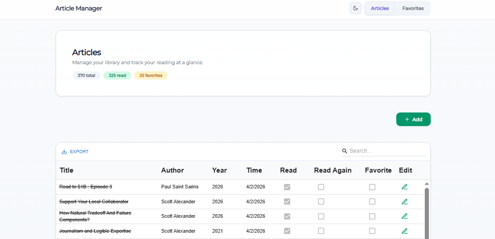
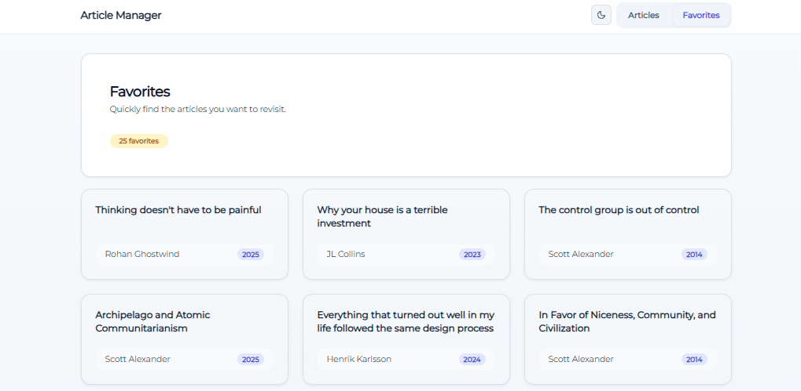

# Article Manager




Web app to **save and search articles** easily. Browse all articles or open your favorite.

## Stack


| Layer    | Technology                                                                                                                                |
| -------- | ----------------------------------------------------------------------------------------------------------------------------------------- |
| Frontend | React 18 (Vite), React Router, Redux Toolkit, MUI X Data Grid, Bootstrap / Reactstrap, Tailwind, Axios, Yup |
| Backend  | Django 5, Django REST Framework, django-cors-headers                                                                                      |
| Database | MySQL                                                                                                                                     |


REST API is mounted at `/api/` (Django router: `articles`, `tags`, `websites`).

## Prerequisites

- Node.js and npm (for the React app)
- Python 3.x and pip (for Django)
- MySQL server and a database for the project

## Getting Started

### Backend (`backend/`)

1. Create a virtual environment and install dependencies:
  ```bash
   cd backend
   python -m venv .venv
   .venv\Scripts\activate   # Windows
   pip install -r requirements.txt
  ```
2. Create a .env file in backend/ (same folder as manage.py) with at least:

```
DJANGO_SECRET_KEY — Django secret key
MYSQL_DATABASE, MYSQL_USER, MYSQL_PASSWORD, MYSQL_HOST, MYSQL_PORT — MySQL connection (see root/settings.py)
```

1. Apply migrations and start the server:

```bash
python manage.py migrate
python manage.py runserver
```

### Frontend (`frontend/`)

The client defaults to `http://127.0.0.1:8000/api`. Override with `VITE_API_BASE_URL` in `frontend/.env` (see `frontend/.env.example` and `src/components/Tools/Constants.ts`). Start the backend first, or point the env var at your API.

```bash
cd frontend
npm install
npm run dev
```

Production build: `npm run build` (output in `frontend/dist/`). Preview locally: `npm run preview`.

